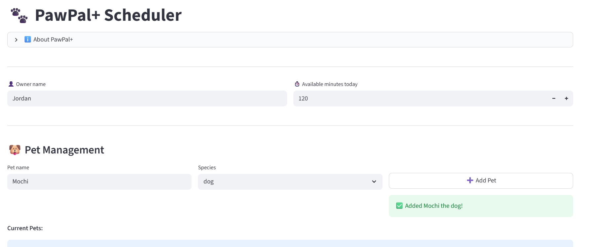

# PawPal+ (Module 2 Project)

You are building **PawPal+**, a Streamlit app that helps a pet owner plan care tasks for their pet.

## Scenario

A busy pet owner needs help staying consistent with pet care. They want an assistant that can:

- Track pet care tasks (walks, feeding, meds, enrichment, grooming, etc.)
- Consider constraints (time available, priority, owner preferences)
- Produce a daily plan and explain why it chose that plan

Your job is to design the system first (UML), then implement the logic in Python, then connect it to the Streamlit UI.

## What you will build

Your final app should:

- Let a user enter basic owner + pet info
- Let a user add/edit tasks (duration + priority at minimum)
- Generate a daily schedule/plan based on constraints and priorities
- Display the plan clearly (and ideally explain the reasoning)
- Include tests for the most important scheduling behaviors

## Implemented Features

### 1. **Priority-Based Greedy Scheduling**
   - **Algorithm**: Sorts all tasks by priority (high=3, medium=2, low=1) in descending order, then greedily adds tasks to schedule if they fit within remaining time budget
   - **Behavior**: High-priority tasks are guaranteed slots first; lower-priority tasks fit what's left
   - **Output**: Separates planned tasks (fit) from skipped tasks (insufficient time)

### 2. **Time-Based Chronological Sorting** 
   - **Algorithm**: Converts HH:MM time strings to minutes since midnight, sorts numerically
   - **Behavior**: Tasks are displayed in chronological order regardless of input order
   - **Example**: Tasks at 18:00, 08:00, 12:30 → sorted to 08:00, 12:30, 18:00

### 3. **Recurring Task Automation**
   - **Daily Recurrence**: When a daily task is marked complete, a new task is automatically generated for `today + 1 day`
   - **Weekly Recurrence**: When a weekly task is marked complete, a new task is automatically generated for `today + 7 days`
   - **Date Handling**: Uses Python's `timedelta` for accurate month/year boundary transitions (e.g., Jan 31 → Feb 1)
   - **Data Preservation**: New task instances inherit title, duration, priority, frequency, and time from original

### 4. **Conflict Detection (Time Overlap Warnings)**
   - **Algorithm**: O(n²) pairwise comparison of all pending tasks; checks if `max(start_a, start_b) < min(end_a, end_b)`
   - **Coverage**: Detects both same-pet conflicts (task A and B for same pet) and cross-pet conflicts (task for pet A vs pet B)
   - **Output**: Returns list of warning messages; empty list = no conflicts
   - **Non-destructive**: Warns instead of blocking, allowing users to make informed decisions

### 5. **Filtered Task Management**
   - **Filter by Completion Status**: Get only done tasks, pending tasks, or all tasks
   - **Filter by Pet**: Get tasks for specific pet(s) or across all pets
   - **Combination**: Filter by both criteria simultaneously (e.g., "pending tasks for Mochi")

### 6. **Schedule Explanation & Reasoning**
   - **Planned Tasks**: Lists chosen tasks with reasoning (order, how they fit)
   - **Skipped Tasks**: Lists tasks that didn't fit with "insufficient time" reason
   - **Time Budget Breakdown**: Shows total scheduled time vs available minutes
   - **Human-Readable Output**: Natural language explanation of scheduling decisions

### 7. **Time Budget Constraint Enforcement**
   - **Greedy Algorithm**: Respects `available_minutes` hard constraint
   - **Remaining Time Tracking**: Subtracts each task duration from budget; stops when next task won't fit
   - **Visual Feedback**: Displays remaining minutes after schedule generation

## 📸 Demo
<a href="Demo1.png" target="_blank"></a>

## Smarter Scheduling Features

- Time-Based Sorting: Sort tasks chronologically by their scheduled time (HH:MM format) for better visualization and planning
- Smart Filtering: Filter tasks by completion status (done/pending) and/or by pet name for targeted task management
- Recurring Task Management: Daily and weekly tasks automatically generate new occurrences when completed, with accurate date calculations using Python's `timedelta`
- Conflict Detection: Lightweight conflict detection identifies when multiple tasks overlap in time (same-pet or cross-pet), generating clear warnings instead of crashing
- Priority-Based Scheduling: Greedy algorithm that prioritizes high-importance tasks first while fitting as many as possible into the available time budget
- Detailed Explanations: Schedule generation includes reasoning for why tasks were included or skipped, helping owners understand the system's decisions

## Testing PawPal+
python -m pytest

Confidence: 3.5 stars

Sorting & Scheduling:
- Chronological task sorting by time (HH:MM)
- Priority-based schedule generation (high → medium → low)
- Time budget constraints (fitting tasks within available minutes)

Recurring Tasks:
- Daily task recurrence (advances by 1 day)
- Weekly task recurrence (advances by 7 days)
- Month/year boundary transitions (e.g., Jan 31 → Feb 1)

Conflict Detection:
- Cross-pet task overlaps
- Same-pet task overlaps
- Non-overlapping tasks (no false positives)

General Functionality:
- Task completion status updates
- Task list management (add/remove)
- Recurring task data preservation (title, duration, priority, time)

## Getting started

### Setup

```bash
python -m venv .venv
source .venv/bin/activate  # Windows: .venv\Scripts\activate
pip install -r requirements.txt
```

### Suggested workflow

1. Read the scenario carefully and identify requirements and edge cases.
2. Draft a UML diagram (classes, attributes, methods, relationships).
3. Convert UML into Python class stubs (no logic yet).
4. Implement scheduling logic in small increments.
5. Add tests to verify key behaviors.
6. Connect your logic to the Streamlit UI in `app.py`.
7. Refine UML so it matches what you actually built.
