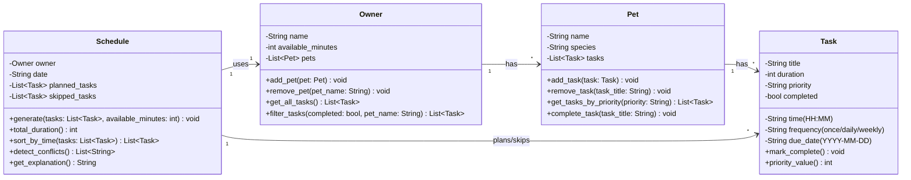

```mermaid
classDiagram
    direction LR

    class Task {
        -String title
        -int duration
        -String priority
        -bool completed
        -String time (HH:MM)
        -String frequency (once/daily/weekly)
        -String due_date (YYYY-MM-DD)
        +mark_complete() void
        +priority_value() int
    }

    class Pet {
        -String name
        -String species
        -List~Task~ tasks
        +add_task(task: Task) void
        +remove_task(task_title: String) void
        +get_tasks_by_priority(priority: String) List~Task~
        +complete_task(task_title: String) void
    }

    class Owner {
        -String name
        -int available_minutes
        -List~Pet~ pets
        +add_pet(pet: Pet) void
        +remove_pet(pet_name: String) void
        +get_all_tasks() List~Task~
        +filter_tasks(completed: bool, pet_name: String) List~Task~
    }

    class Schedule {
        -Owner owner
        -String date
        -List~Task~ planned_tasks
        -List~Task~ skipped_tasks
        +generate(tasks: List~Task~, available_minutes: int) void
        +total_duration() int
        +sort_by_time(tasks: List~Task~) List~Task~
        +detect_conflicts() List~String~
        +get_explanation() String
    }

    Owner "1" --> "*" Pet : has
    Pet "1" --> "*" Task : has
    Schedule "1" --> "1" Owner : uses
    Schedule "1" --> "*" Task : plans/skips
```
